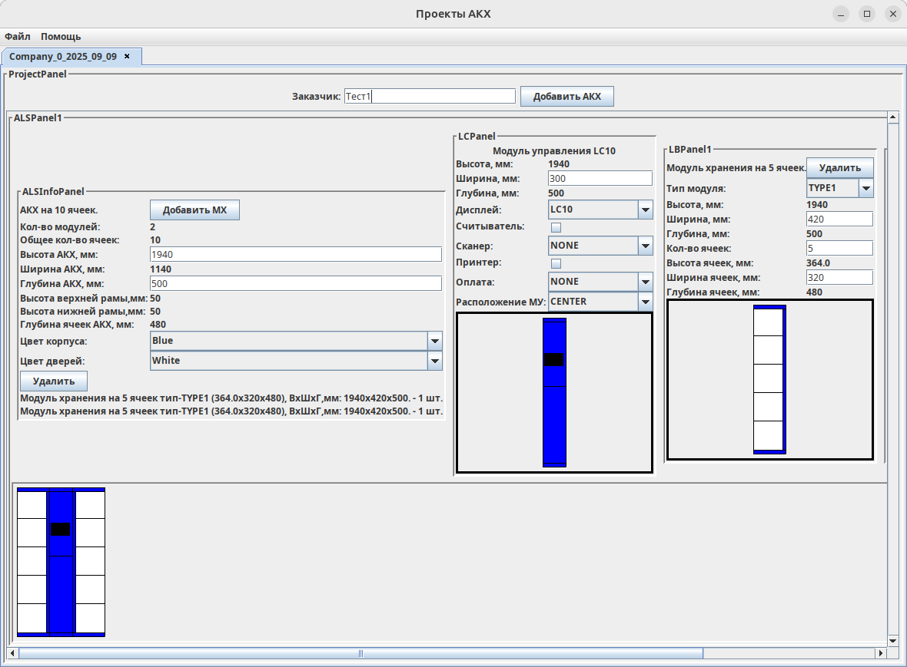
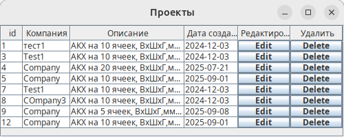

# LB_CALC
## Описание

Тренировочное десктоп приложение для расчета размеров и визуализации автоматических камер хранения и постаматов.
Создание, редактирование в базе данных проектов с камерами хранения, возможность быстро создать коммерческое предложение 
с техническими характеристиками, эскизом для клиента.

## Цели
Практическое освоение навыков работы с библиотекой Swing, логированием Slf4j, 
CRUD операции с базой данных MySQL при помощи JDBC API, сериализация/десериализация объектов JSON, XML с Jackson API,
с файлами Java IO, системой сборки проектов MAVEN, системой контроля версий GIT, применение принципов ООП, 
шаблона проектирования MVC.

## Функции
## Технологии
* Swing
* Slf4j
* JDBC
* MySQL
* MAVEN

